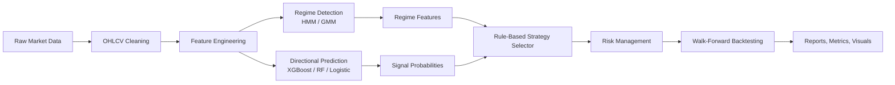

# Regime-Aware Derivatives Trading

Production-style Python research repository for systematic trading in Indian index derivatives, designed for a student-run workflow that supports research, paper trading, small-capital live deployment, and MFE / quant internship portfolio presentation.

## Overview

This project builds an end-to-end regime-aware workflow for:

1. Detecting market states with unsupervised learning.
2. Predicting short-horizon directional moves with supervised learning.
3. Mapping forecasts into futures or options strategy templates.
4. Running walk-forward backtests with transaction costs and slippage.
5. Producing institutional-style performance analytics and plots.

The initial focus is on:

- NIFTY futures
- BANKNIFTY futures
- NIFTY options
- BANKNIFTY options

The codebase is modular so each component can be improved independently: data ingestion, feature engineering, regime inference, signal modeling, strategy selection, risk management, and performance reporting.

## Pipeline



## Repository Layout

```text
regime-aware-derivatives-trading/
├── config/
│   └── parameters.yaml
├── data/
│   ├── raw/
│   └── processed/
├── notebooks/
│   ├── 01_data_collection.ipynb
│   ├── 02_feature_engineering.ipynb
│   ├── 03_regime_detection.ipynb
│   ├── 04_signal_generation.ipynb
│   ├── 05_strategy_selection.ipynb
│   └── 06_backtesting.ipynb
├── results/
│   ├── figures/
│   ├── tables/
│   └── reports/
├── src/
│   ├── __init__.py
│   ├── backtester.py
│   ├── data_loader.py
│   ├── features.py
│   ├── options_strategy.py
│   ├── performance.py
│   ├── regime_detection.py
│   ├── risk_management.py
│   ├── signal_model.py
│   └── utils.py
├── tests/
├── requirements.txt
├── .gitignore
└── README.md
```

## Modeling Stack

### Regime Detection

- `Hidden Markov Model` as the preferred market-state model.
- `Gaussian Mixture Model` as a simpler baseline.

The detector returns:

- `regime_id`
- `regime_probability`
- state probability columns
- transition matrix
- regime duration statistics

### Directional Signal Models

- `XGBoost` as the primary prediction model.
- `Random Forest` as a nonlinear benchmark.
- `Logistic Regression` as a transparent classification benchmark.

Supported targets:

- Binary classification: forward return above threshold.
- Multi-class classification: bearish / neutral / bullish.
- Regression: expected forward return.

### Strategy Selection

Rule-based options strategy mapping driven by:

- regime label
- model probability
- volatility level
- trend strength

Current strategy templates:

- Long Call
- Long Put
- Bull Call Spread
- Bear Put Spread
- Iron Condor
- Long Straddle

## Feature Set

The feature engine includes:

- Daily returns and log returns
- Rolling and realized volatility
- Drawdown
- Momentum over 5, 10, and 20 days
- RSI
- MACD
- ATR and ATR percent
- Bollinger Band width
- ADX with directional indicators
- Volume change and relative volume
- India VIX integration
- Optional derivatives features such as open interest, put-call ratio, implied volatility, IV skew, and term structure
- Regime-aware features such as regime label, probability, and duration

All engineered features are lagged by default to avoid look-ahead bias in research and backtesting.

## Installation

### 1. Create an environment

```bash
python -m venv .venv
.venv\Scripts\activate
```

### 2. Install dependencies

```bash
pip install -r requirements.txt
```

### 3. Run tests

```bash
pytest -q
```

## Quick Start

### Download baseline data

```python
from src.data_loader import MarketDataLoader

loader = MarketDataLoader(default_interval="1d")
nifty = loader.download_yfinance("^NSEI", start="2018-01-01")
```

### Build features

```python
from src.features import FeatureEngineer

engineer = FeatureEngineer(lag_features_by=1)
feature_frame = engineer.build_features(nifty)
```

### Detect regimes

```python
from src.regime_detection import RegimeDetector

detector = RegimeDetector(method="hmm", n_regimes=3, random_state=42)
regime_result = detector.fit_predict(
    feature_frame,
    feature_columns=["daily_return", "rolling_volatility_20", "atr_percent"],
)
```

### Train a signal model

```python
from src.signal_model import DirectionalSignalModel, create_targets

dataset = create_targets(feature_frame.join(regime_result.assignments), horizon=5, return_threshold=0.015)
model = DirectionalSignalModel(model_name="xgboost", task_type="binary")
model.fit(dataset, feature_columns=["momentum_5", "rsi_14", "atr_percent"], target_column="target_binary")
```

### Run a walk-forward backtest

```python
from src.backtester import WalkForwardBacktester

backtester = WalkForwardBacktester(
    model_name="xgboost",
    task_type="binary",
    train_window=252,
    test_window=21,
    probability_threshold=0.55,
    transaction_cost_bps=2.5,
    slippage_bps=1.0,
)

result = backtester.run(
    dataset.dropna(),
    feature_columns=["momentum_5", "rsi_14", "atr_percent"],
    target_column="target_binary",
)
```

## Performance Metrics

The analytics layer computes:

- CAGR
- Sharpe Ratio
- Sortino Ratio
- Calmar Ratio
- Max Drawdown
- Alpha
- Beta
- Information Ratio
- Win Rate
- Profit Factor
- Expectancy

The framework also includes reusable plotting helpers for:

- Equity curve
- Drawdown chart
- Rolling Sharpe ratio
- Feature importance
- SHAP summary plot
- Regime overlay
- Confusion matrix
- ROC curve
- Transition matrix heatmap

## Notebooks

The notebook sequence mirrors a realistic research workflow:

1. `01_data_collection.ipynb`: download and store baseline data.
2. `02_feature_engineering.ipynb`: generate model features and inspect them.
3. `03_regime_detection.ipynb`: fit HMM / GMM regime models and visualize states.
4. `04_signal_generation.ipynb`: create targets, train XGBoost, and evaluate signals.
5. `05_strategy_selection.ipynb`: map predictions to derivatives structures.
6. `06_backtesting.ipynb`: run walk-forward validation and save performance outputs.

## Design Choices

- `Config-driven`: major model, feature, and backtest parameters live in `config/parameters.yaml`.
- `Leakage-aware`: engineered features are lagged by default.
- `Research-first`: notebooks and reusable modules support fast iteration.
- `Production-minded`: tests, type hints, docstrings, and modular classes make the code easier to extend into paper or live trading.
- `Derivatives-ready`: options strategy selection is implemented now, while richer option-chain payoff modeling can be layered in later.

## Limitations

- Yahoo Finance is useful for baseline index research but should not be treated as the final source for production derivatives execution.
- The current backtester simulates directional exposure cleanly; full option-chain pricing and Greeks-aware execution should be added before serious live options deployment.
- Live broker routing, paper-trading adapters, and portfolio-level exposure management are intentionally left as the next extension step.

## Future Enhancements

- NSE / broker API integration for futures and options chains
- Option payoff engine with Greeks and expiry-aware backtests
- Cross-instrument portfolio optimization across NIFTY and BANKNIFTY
- MLflow or experiment tracking integration
- Hyperparameter search and model registry
- Live execution adapters with trade journaling and alerts
- Dashboarding for daily monitoring and post-trade analytics

## Suggested Workflow For This Repo

1. Start with spot and volatility proxies to validate the pipeline.
2. Replace the raw inputs with exchange or broker-level futures / options data.
3. Add instrument-specific contract sizing and transaction costs.
4. Extend the rule engine into a richer portfolio construction layer.
5. Add paper trading before live deployment.

## Disclaimer

This repository is for educational and research purposes. It is not investment advice. Real-money deployment requires stronger data validation, execution monitoring, broker integration, and risk controls than a research prototype alone.
